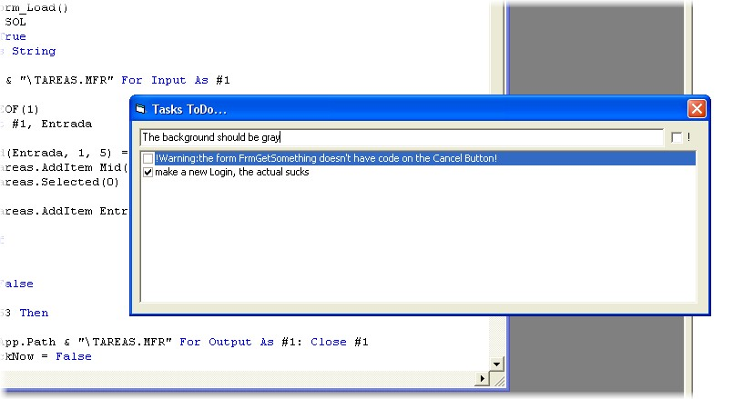

<div align="center">

## \[     A\- taskToDo LIKE Vb\.Net    \]


</div>

### Description

are you tired to forget what do you want to change of your code when you are debuggin?? when you stop debug you cant remember wich was the error, if there where a lot of errors? this utility may help you, its like VB.NET task to do utility
 
### More Info
 
the issue that must be Checked, revised, etc

it uses a file opened for input, and for output.

Also uses String Operators, like MID. its very usefull

nothing, it only remains, also if you shut down it.

if you want to delete some task, you cant :(.

because i just were so laaasy to do it, but you can delete the *.MFR file on app.path


<span>             |<span>
---                |---
**Submitted On**   |2004-03-29 04:50:06
**By**             |[FUCCI, Leonardo Hernan](https://github.com/Planet-Source-Code/PSCIndex/blob/master/ByAuthor/fucci-leonardo-hernan.md)
**Level**          |Intermediate
**User Rating**    |4.0 (8 globes from 2 users)
**Compatibility**  |VB 4\.0 \(32\-bit\), VB 5\.0, VB 6\.0
**Category**       |[Files/ File Controls/ Input/ Output](https://github.com/Planet-Source-Code/PSCIndex/blob/master/ByCategory/files-file-controls-input-output__1-3.md)
**World**          |[Visual Basic](https://github.com/Planet-Source-Code/PSCIndex/blob/master/ByWorld/visual-basic.md)
**Archive File**   |[LikeVb\_Net1725863292004\.zip](https://github.com/Planet-Source-Code/fucci-leonardo-hernan-a-tasktodo-like-vb-net__1-52716/archive/master.zip)

### API Declarations

```
UNDERSUN Studios.
Fucci, Leonardo Hernan (UvChenko)
visit www.meetfinder.ar.tc for chating whit your friends with my programm, based on VB6!!!
```


